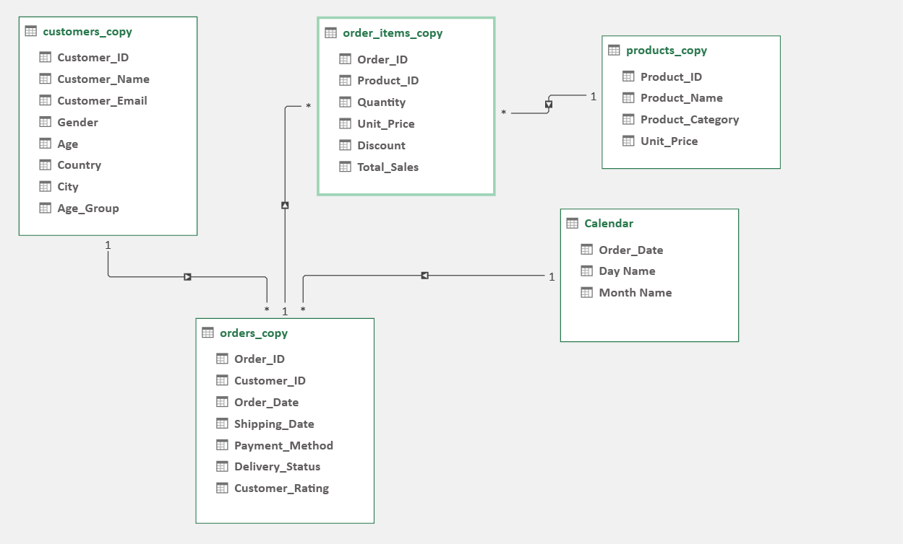
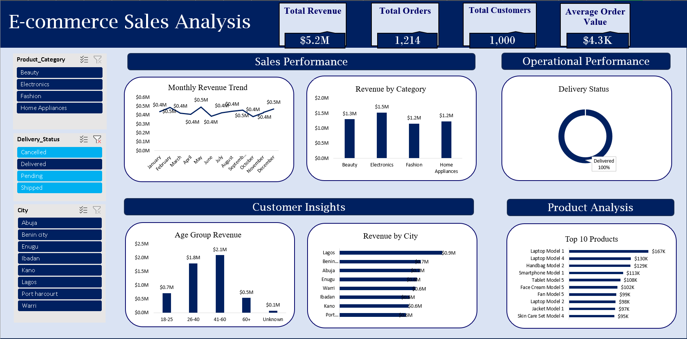
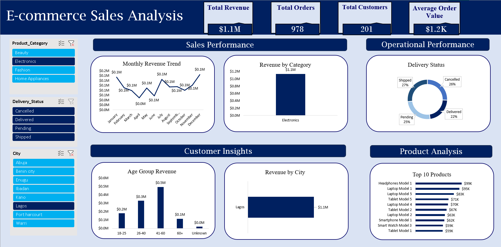
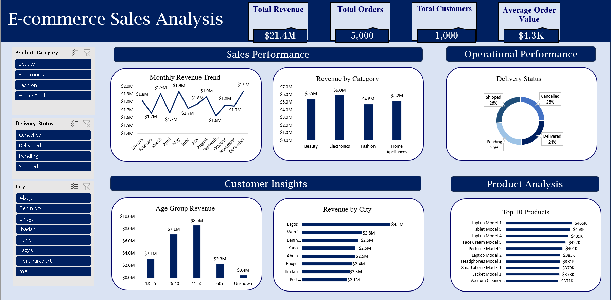

# E-Commerce-Sales-Analytics-Project
End-to-end e-commerce sales analytics: SQL data cleaning and business analysis, Power Pivot data modelling, and an interactive Excel dashboard.

## Project Overview

This project analyzes an e-commerce sales dataset to uncover insights about revenue performance, customer behavior, product performance, and operational efficiency.

It follows an end-to-end data analytics workflow:

**Data Cleaning → SQL Analysis → Data Modelling → Dashboard Development**

The goal was to transform raw transactional data into insights that support real business decisions — not just to run queries, but to interpret what the numbers mean.

---

## Business Problem

An e-commerce company wants to understand its sales performance and customer purchasing behavior. The analysis answers:

- How much revenue has the business generated?
- Which product categories contribute the most revenue?
- Which cities have the highest sales performance?
- Which customer age groups generate the most revenue?
- What are the top-performing products?
- How efficient is the delivery process?

---

## Tools Used

| Tool | Purpose |
|---|---|
| SQL Server | Data cleaning and business analysis |
| Excel | Dashboard creation and visualization |
| Power Pivot | Data modeling and table relationships |
| Pivot Tables | Interactive analysis |

---

## Dataset

The dataset contains e-commerce transactions across 5,000 orders and 100 products, spanning:

- Order information
- Customer details
- Product information
- Sales transactions
- Payment details
- Shipping information
- Delivery status

Multiple tables are connected through relationships (orders, order items, customers, products).

---

## Data Cleaning Process

Before analysis, the raw dataset was cleaned to resolve several data quality issues:

- Removed duplicate records
- Standardized inconsistent text values
- Corrected formatting issues
- Handled missing values
- Validated numerical fields
- Corrected inaccurate sales calculations
- Checked relationships between tables
- Created calculated fields for analysis

📄 **File reference:** [Data_Cleaning_SQL.sql](SQL/Data_Cleaning_SQL.sql)

---

## SQL Analysis

SQL was used to answer 8 core business questions, progressing from foundational metrics to advanced query techniques (CTEs, subqueries, and window functions).

**Sales Performance**
- Total revenue generated
- Total orders and average order value
- Monthly revenue trend

**Product Performance**
- Revenue by product category
- Products performing above average revenue (CTE + subquery)
- Product ranking within each category (window function)

**Customer Analysis**
- Revenue by city

**Operational Analysis**
- Delivery status distribution (delivered, pending, shipped, cancelled)

Each query is documented with its business question, purpose, SQL code, result, and a written insight interpreting what the number means for the business.

📄 **File reference:** [Data_Analysis_SQL.sql](SQL/Data_Analysis_SQL.sql) 
(see the full breakdown with results and insights here: [02_SQL_Analysis.md](SQL/02_SQL_Analysis.md))

---

## Data Model

A relational data model was built in Excel using Power Pivot, connecting:

- Orders Table
- Order Items Table
- Customers Table
- Products Table
- Calendar Table

This model powers the Pivot Tables and interactive filters behind the dashboard below.



---

## Dashboard

The Excel dashboard brings the SQL and data model together into an interactive view.

**Key Performance Indicators**
- Total Revenue
- Total Orders
- Total Customers
- Average Order Value

**Sales Performance**
- Monthly Revenue Trend
- Revenue by Category

**Customer Insights**
- Revenue by Age Group
- Revenue by City

**Product Analysis**
- Top 10 Products by Revenue

**Operational Performance**
- Delivery Status Analysis

**Interactive slicers** filter the dashboard by Product Category, Delivery Status, and City.




📄 **File reference:** [Ecommerce_Sales_Analysis_Dashboard.xlsx](Ecommerce_Sales_Analysis_Dashboard.xlsx)

---

## Key Insights

- **Electronics generated the highest revenue** among product categories, though performance within it is concentrated in a small number of top products (Laptops, Tablets).
- **Lagos is the dominant market**, generating nearly 48% more revenue than the next-highest city.
- **Customers aged 41–60 contributed the highest revenue.**(From pivot tables and dashboard)
- **49% of products perform above the category average**, indicating a diverse catalog rather than reliance on a few bestsellers.
- **24% of orders are cancelled** — a meaningful operational gap worth addressing, since it directly limits realized revenue.

---

## Recommendations

**Based on the findings above, the analysis points to four concrete actions:**

1.**Invest further in Electronics.** It leads category revenue and contains several of the highest-grossing individual products (Laptop and Tablet models) — the strongest area to double down on for inventory and promotion.

2.**Prioritize Lagos and the 41–60 age group.** Both stand out as the strongest revenue segments and are natural priorities for marketing spend and retention efforts.

3.**Focus inventory on consistent performers.** With only 49% of products driving above-average revenue, re-evaluate the lowest-ranked product in each category (e.g., Smartphone Model 2, Sneakers Model 5) as candidates for discounting or discontinuation.

4.**Investigate order cancellations.** At 24%, this is the single highest-leverage fix available — reducing it converts already-placed orders into realized revenue without needing to acquire new customers.

---
## Project Files

```
├── Dataset/
├── SQL/
│   ├── Data_Cleaning.sql
│   └── Sales_Analysis.sql
├── Excel_Dashboard/
├── Data_Model/
└── Dashboard_Image/
```

---

## Dashboard Preview



---

## Conclusion

This project demonstrates an end-to-end data analytics workflow — from data cleaning and SQL-based business analysis to data modeling and dashboard development in Excel.

This project strengthened my skills in:

- SQL querying (joins, CTEs, subqueries, window functions)
- Data cleaning and validation
- Relational data modeling
- Business analysis and insight-writing
- Dashboard development
- Turning analysis into clear, actionable recommendations
